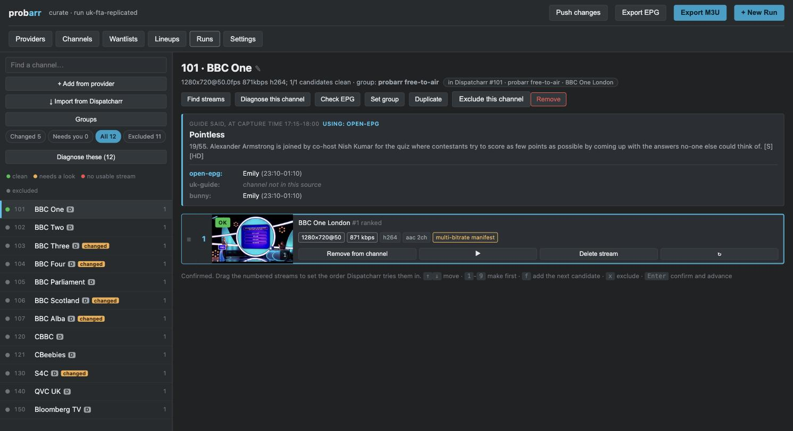
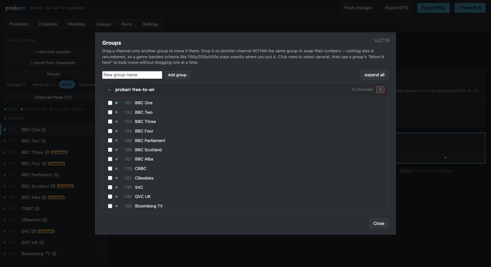

# probarr

**Verify, compare and visually curate IPTV streams.**

Providers list the same channel dozens of times — `UK: Meridian Sports 1`,
`UKFHD | Meridian Sports 1`, `UKUHD: Meridian Sports 1 UHD`, `HEVC FHD Meridian Sports 1`.
Most are dead, corrupted, or serving a placeholder card. probarr works out
which ones actually play, ranks them, and shows you the pictures so you can
make the final call.

Provider-agnostic: any M3U or Xtream source in; M3U or Dispatcharr out.





## Why another stream checker

There are many playlist checkers. They answer *"is this URL alive?"*. probarr
answers *"which of these forty candidates should be my Meridian Sports 1, and is
it actually showing Meridian Sports 1?"* Three things it does that others don't:

**It decodes, rather than reading metadata.** Every other checker calls
`ffprobe` and trusts the answer. A stream can report a flawless 1920x1080@50
HEVC and still decode into continuous `Skipping invalid undecodable NALU`
errors — perfect metadata, unwatchable picture. probarr decodes a real sample
and counts the errors.

**It detects provider placeholder cards.** When a provider is out of
connections it serves a banner, re-encoded per "channel" so no checksum
matches. probarr compares frames perceptually and flags a still picture served
across several different channels.

**It shows you the frames.** Some faults are only visible to a person: the
guide says one film and a different film is playing. No probe finds that. A
grid of thumbnails finds it instantly.

## Install

Docker is the supported path — it bundles ffmpeg and needs nothing on the host,
identically on Windows, macOS and Linux.

```bash
docker run -d --name probarr -p 7799:7799 -v ./config:/config ghcr.io/probarr-dev/probarr:latest
```

Then open `http://localhost:7799`.

The image is built and published straight from this repo's own source by
GitHub Actions (`.github/workflows/docker-publish.yml`) on every push to
`main`, so `:latest` is always exactly what's on `main` here — nothing
hand-uploaded. If you'd rather build it yourself (it takes seconds: stdlib
only, no dependency resolution) or you're working from your own fork:

```bash
git clone https://github.com/probarr-dev/probarr.git
cd probarr
docker build -t probarr .
docker run -d --name probarr -p 7799:7799 -v ./config:/config probarr
```

Runs as a plain script too, if you have `ffmpeg`, `ffprobe` and Python 3.9+:
there are no Python dependencies at all.

```bash
python3 -m probarr --root ./config verify --source playlist.m3u
```

## Use

```bash
# Verify a playlist and build a contact sheet
probarr verify --source https://example.com/list.m3u --regions UK

# Only the channels you actually want, with expected programmes from a guide
probarr verify --source list.m3u --wantlist channels.txt \
               --epg https://example.com/guide.xml.gz

# Rebuild the sheet from a stored run
probarr sheet --run 20260821-081343

# See exactly how a title is matched — the matcher fails silently otherwise
probarr explain "UKUHD: Meridian Sports 1 UHD" --source playlist.m3u
```

### Concurrency

Defaults to **1**, on purpose. Many providers cap simultaneous connections, and
exceeding the cap does not return a clean error — it returns plausible garbage
that looks exactly like a dead stream, so parallel probing silently poisons its
own results.

Set it to what your subscription actually allows, in `/settings` or with
`--concurrency`, leaving headroom for whoever is watching television. A
three-stream account probes roughly three times faster than a one-stream one.
The settings page estimates run time live as you change it.

## The wantlist

The single most important input for a large provider. Without one, verifying
means probing every candidate for all 55,000 listed streams — not a long job,
an impossible one. With one, probarr probes only what you asked for.

```
# channels.txt — number optional, |tvg-id optional
101: BBC One
102: BBC Two
BBC Four
401: Meridian Sports Main Event | meridian.main.uk
```

Channels that match nothing are reported loudly rather than skipped: the usual
cause is a naming difference, not a missing channel, and the fix is an alias
nobody will write if the omission is silent. Inexact matches are reported too —
a guess the operator cannot see is a guess they cannot correct.

Create and edit wantlists in the UI at `/wantlists` — download a template,
import a file, or paste a list, with a live preview showing exactly what
probarr parsed and warning about duplicates and unparseable lines. Saved lists
can be used by name: `--wantlist uk-lineup`.

## The guide check

Pass `--epg` with an XMLTV file or URL and probarr records **what the guide said
should be playing at the exact moment each frame was captured**, storing it
alongside the frame.

This is the one check no probe can perform. A stream can be alive, clean,
high-bitrate and showing entirely the wrong programme. With the expected title
printed above the thumbnail, that is a glance instead of an investigation.

Guide and playlist channel ids rarely line up, so matching falls back to
display names — and **refuses to guess when ambiguous**, because attaching the
wrong region's listings is worse than showing none.

## Curating

`/run/<id>/curate` is built for working through a long list: wantlist on the
left with status dots, candidates on the right, driven from the keyboard.

| Key | Action |
|---|---|
| `↑` `↓` / `j` `k` | move between channels |
| `1`–`9` | set that candidate as primary |
| `f` | set a fallback |
| `x` | exclude the channel |
| `Enter` | confirm and advance |
| `c` | in the viewer, toggle full frame / 1:1 crop |

Each candidate also has a **re-probe** button (`↻`), for when a capture landed
in an ad break, on a channel ident, or on the one dark shot in a bright
programme.

Re-probes go through a queue rather than running on the spot. The button is
trivially spammable, and inline probing would open one connection per click —
straight through a provider allowance that may be a single stream, in the one
situation where exceeding it is most misleading, because the resulting "dead
stream" looks like the button diagnosing a real fault. The queue runs at most
`concurrency` probes at once, paces launches by the configured gap, refuses to
queue the same stream twice, and applies a short cooldown.

Each candidate is captured three ways from one decoded frame: a grid thumbnail,
a full frame, and a **1:1 native centre crop**. The crop matters because scaling
defeats the comparison people actually need — judging whether a 1080p encode is
worse than a 720p one means seeing blocking and ringing at native pixels.

Frames are chosen with ffmpeg's `thumbnail` filter rather than by timestamp. In
testing, taking the first frame past a fixed time produced a solid black
thumbnail for a perfectly healthy channel, which is a total failure in a tool
whose premise is "look at the picture".

Selections persist server-side, so they survive a different browser or machine.

## What the statuses mean

| Status | Meaning |
|---|---|
| `ok` | decoded a real, moving picture with no corruption |
| `dirty` | decodes, but with corruption errors — watchable at best |
| `placeholder` | the same still picture is served for several channels |
| `no_frame` | responded to ffprobe, but no frame could be decoded |
| `no_video` | responded, but carries no video stream |
| `dead` | no response |

A **low motion** flag is advisory only, never a verdict. Measured against live
UK broadcast, the classes genuinely overlap:

| Stream | Motion | Reality |
|---|---|---|
| BBC Four | 1.12 | off-air card |
| **BBC One** | **1.87** | **live — studio interview** |
| BBC Three | 2.25 | off-air card |

Live content scored *between* two placeholder cards, so no threshold separates
them. probarr does not pretend otherwise: it flags the low end and lets you
read the words on the picture. This is the argument for the contact sheet.

## Ranking

1. **Integrity before quality, always.** A clean 720p feed beats a corrupted 4K
   one — the corrupt stream is unwatchable and its metadata says nothing.
2. Higher pixel rate (width x height x fps). 1080p50 genuinely beats 1080p25.
3. Higher *measured* bitrate — measured, because declared bitrate is missing or
   fictional on most live streams.
4. **HEVC as a tiebreak only.** It is not a quality signal; some of the worst
   corruption found while building this was HEVC.

## Security

No credentials are ever committed. `scripts/check-secrets.sh` runs as a
pre-commit hook from the first commit — git history is permanent, so deleting a
leaked secret later does not remove it. Install with `scripts/install-hooks.sh`.

Contact sheets carry **redacted** URLs, so a sheet can be shared without
handing over a subscription.

## Status

Early. The capture-and-stamp engine and contact sheet work; the web UI is
currently a run browser, with a channel-list-driven curation view in progress.

## License

TBD — see the note on AGPL in `docs/` before vendoring anything from
Dispatcharr.

## Getting started (from the browser)

1. **Providers** — add your IPTV subscription (a playlist URL, or
   `xtream://`/`dispatcharr://` credentials). "Test connection" confirms it
   before you save it.
2. **Wantlists** — optional, but the only realistic option on a large
   provider: paste or import the channels you actually want.
3. **+ New Run** — pick a provider and (optionally) a wantlist, hit
   *Start verifying*. Progress streams live; when it finishes you land
   straight in Curate.
4. **Curate** — pick a stream per channel, export the M3U.

Nothing here requires the CLI. It still exists for scripting/cron use, and
does exactly what the browser flow does under the hood (`probarr/runner.py`
is the one implementation both share).

## Exporting to Dispatcharr

If you already run Dispatcharr, "Export to Dispatcharr" on the Curate page
pushes your curated picks straight into it — creates or updates channels,
sets streams, links logos, re-matches EPG. Same self-healing pattern as a
plain re-run: run the export again after tweaking your picks and it
re-asserts rather than duplicates.

The export target is a saved **Provider** — the same concept as a source,
deliberately. If the run was itself sourced from a saved Dispatcharr
provider, the export panel defaults to pushing back into that exact
instance, no extra configuration needed. You can still choose a different
saved Dispatcharr provider as the target (probe from one place, publish to
another).

Two fallback strategies, presented as an explicit choice with no default —
this is a real trade-off, not a technical detail to bury:

- **Native**: one channel, `streams: [primary, fallback]`. Dispatcharr's own
  failover switches automatically. No lineup clutter; the fallback isn't
  individually selectable.
- **Separate channel**: a second channel named `FALLBACK: …`, streaming only
  the fallback. Doubles the lineup, but it's visible and pickable by hand.

Candidates that already belong to the target Dispatcharr instance reuse
their existing stream id directly. Everything else (a plain M3U probe, or a
different Dispatcharr instance) gets a real custom stream created in the
target (`is_custom: true`), matched by URL on repeat pushes so re-exporting
never piles up duplicates.

## Browsing a source without probing

`/browse` (linked from Wantlists) is the answer to "I don't have a wantlist
and don't know what to type." Pick a saved Provider, load it, and probarr
groups the raw channel names — no ffmpeg, no waiting, near-instant even on a
huge catalogue, since it's the same text-grouping a run already does before
probing starts. Forty spellings of the same channel collapse into one row
with a count and an expandable list of what got grouped, so you can actually
see the matcher working rather than trust it blindly. Tick what you want,
save it as a wantlist; saving over an existing name appends rather than
replacing, so a starter list can be extended as you browse a second
provider.

## Two things learned from a real buffering report

**Advisory flags, computed on every probe, free:**

- `multi_bitrate_manifest` — the source is a multi-rendition manifest (an
  HLS master playlist or a DASH `.mpd` with several AdaptationSets), rather
  than a single fixed-quality stream. Detected by counting video streams in
  the metadata probe, which was already being fetched.
- `dash_multi_bitrate` — the stronger, evidenced signal. Tested directly: a
  channel's DASH source and its HLS fix exposed the *same* four renditions,
  yet only the DASH one caused real buffering through a relay in production.
  Variant count alone didn't predict it; container format did. Only this
  flag carries a ranking penalty — `multi_bitrate_manifest` alone is shown
  as informational, deliberately not penalised, because the data doesn't
  support treating it as a fault on its own.
- `slow_fetch` — the capture took close to real-time or longer to download.
  Healthy live segments normally arrive far faster than real-time; a source
  that can't keep up is a genuine buffering signal, computed from timing
  data already gathered for bitrate measurement.

**Diagnose this channel** (Curate, per channel) — for when one channel
misbehaves in a real player and a single still frame doesn't explain why.
Re-probes every candidate for that channel with a longer sample (25s) and
keeps the video clip instead of discarding it, so you can actually watch
the few seconds that were measured. Clips are fragmented MP4
(`frag_keyframe+empty_moov`), not `+faststart` — the latter needs a clean
process exit to rewrite its index, and a killed or timed-out capture left a
`moov atom not found` file that no player could open. Fragmented MP4 writes
its index up front, so a clip stays valid even if the capture is cut short.
